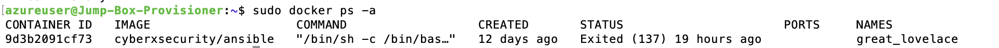

1. SSH into the jumpbox
2. Use docker ps -a to verify the name of the Ansible container (this won't change so once you know it you can create a short script to make opening easier)

3. Once you have the name start the container and enter it with the below statements

        - sudo docker start great_lovelace
        - sudo docker exec -it great_lovelace /bin/bash
        Note: Replace 'great_lovelace' with the local name of the Ansible container

4. Once inside the Ansible container the prompt will change to root@[Container ID]:~#
5. Ensure each VM has had the public key supplied from the SSH Key Gen and the Private key is located in the Ansible .ssh directory.
    
        root@9d3b2091cf73:~/.ssh# ls
        id_rsa  id_rsa.pub  known_hosts

6. Also ensure that the Ansible hosts file has the Webservers listed. This is located in /etc/ansible/hosts and should look as per below (with the local IP address of the VMs assigned)

        [webservers]
        10.1.0.6 ansible_python_interpreter=/usr/bin/python3
        10.1.0.5 ansible_python_interpreter=/usr/bin/python3
        10.1.0.9 ansible_python_interpreter=/usr/bin/python3

7. Then execute the [ELK Playbook YAML](Ansible/ELKInstallPlaybook.yml) by navigating to the directory with the playbook and using 'ansible-playbook [ELK Install PLaybook Name]. The final result should look like below.

 8. Then to install both MetricBeats and FileBeats we first need to save the two configuration files to the /etc/ansible/files directory [File Beats Configuration File](Ansible/filebeat-config.yml) and [Metric Beats Configuration File](Ansible/metricbeat-config.yml).
 9. Both these files have to be modified so that the Hosts IP address refer to the IP address of the ELK Stack VM created.
10. Then the following Playbooks can be installed via the ansible-playbook command [FileBeat Playbook](/Ansible/FileBeatInstallPlaybook.yml) and [MetricBeat Playbook](Ansible/MetricBeatInstallPlaybook.yml)
11. Once done Navigate to the IP adress of the ELK VM, Port 5601 as per http://[ELKStackVM]:5601/app/kibana#/home

