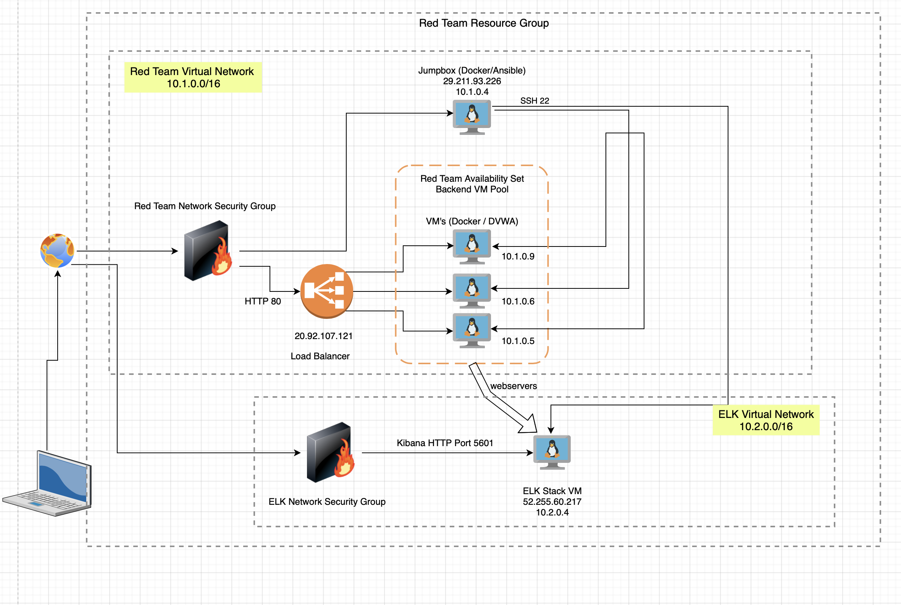
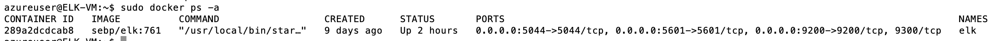
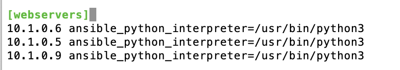

## Automated ELK Stack Deployment

The files in this repository were used to configure the network depicted below.

These files have been tested and used to generate a live ELK deployment on Azure. They can be used to either recreate the entire deployment pictured above. Alternatively, select portions of the playbook files may be used to install only certain pieces of it, such as Filebeat.

This document contains the following details:
- Description of the Topology
- Access Policies
- ELK Configuration
  - Beats in Use
  - Machines Being Monitored
- How to Use the Ansible Build

### Description of the Topology

The main purpose of this network is to expose a load-balanced and monitored instance of DVWA, the D*mn Vulnerable Web Application.

Load balancing ensures that the application will be highly available, in addition to restricting access to the network.

Integrating an ELK server allows users to easily monitor the vulnerable VMs for changes to the docker containers and system files.

The configuration details of each machine may be found below.

| Name     | Function | IP Address | Operating System |
|----------|----------|------------|------------------|
| Jump Box | Gateway  | 10.1.0.4 / 29.211.83.226  | Linux            |
| VM1      | DVWA Webserver | 10.1.0.5 |  Linux      |
| VM2      | DVWA Webserver | 10.1.0.6   |Linux       |
| VM3      | DVWA Webserver | 10.1.0.9    |Linux      |
| ELK      | ELK Stack Server | 10.2.0.4 / 52.255.60.217  |Linux      |
| Load Balancer | DVWA Webserver Balancer| 20.92.107.21| N/A|

### Access Policies

The DVWA Web Servers on the internal network are not exposed to the public Internet. They are part of the back end pool of Virtual Machines being managed by a public facing load balancer.

Only the Jumpbox and the ELK Virtuals machine can accept connections from the Internet. In order to make external access easier the public facing machines (Jumpbox, Load Balancer and ELK Stack) all have static IPs which are listed in the table above next to the internal network IP.

Machines within the network can only be accessed by the Jumpbox (10.1.0.4) via SSH port 22 only.

Therefore the list of inbound rules setup to allow this configuration are (note 220.235.xxx.xxx is the IP address of the Author - Andrew Hurba);

| Name     | Ports Alowed | Inbound IP Addresses | Purpose |
|----------|---------------------|----------------------|------------|
| JumpBox | 22             | 220.235.xxx.xxx   | Allow external SSH access to the jumpbox
| SSH from Jumpbox | 22 | 10.1.0.4 | Allow internal SSH access from jumpbox to VMs
| ELK | 5601 | 220.235.xxx.xxx | Allow external access to Kibana |
| DVWA | 80 | 220.235.xxx.xxx | Allow external access through Load Balancer to DVWA|

Whilst this is a robust setup in terms of access management, it relies solely on a single IP listing for external access. Any additional access will require a rule update. Also whilst the Authors NBN connection has a fairly 'sticky' IP if it changes access will be denied. A VPN would be preferrable for a longer term solution.

In terms of SSH management, to add another layer of security, the VMs were setup with the public key of azureuser whose private keys reside on the PC of the author.

### Elk Configuration

Ansible was used to automate configuration of the ELK machine. No configuration was performed manually, which is advantageous because we can be assured that the installation will work in exactly the way it is intended. In addition this type of automation is scaleable.

The playbook implements the following tasks:
The [ELK Playbook](Ansible/ELKInstallPlaybook.yml) performs a number of tasks.

- The ELK server is initially defined within the Ansible Hosts File and this IP address is used to execute the following steps
- Docker.io is installed
- Python Package installer is installed
- PIP Docker module installed
- Virtual Memory increased and used
- ELK Container downloaded and launched on the ELK server and then set to start on reboot.

The following screenshot displays the result of running `docker ps` after successfully configuring the ELK instance.

### Target Machines & Beats
This ELK server is configured to monitor the following machines via the webservers group created in the Ansible Hosts file. This is shown below

In addition two other playbooks were created to install [MetricBeat](Ansible/MetricBeatInstallPlaybook.yml) and [FileBeat](Ansible/FileBeatInstallPlaybook.yml)

These Beats allow us to collect the following information from each machine:
- _TODO: In 1-2 sentences, explain what kind of data each beat collects, and provide 1 example of what you expect to see. E.g., `Winlogbeat` collects Windows logs, which we use to track user logon events, etc._

### Using the Playbook
In order to use the playbook, you will need to have an Ansible control node already configured. Assuming you have such a control node provisioned: 

SSH into the control node and follow the steps below:
- Copy the _____ file to _____.
- Update the hosts file to include the IP addresses of the VMs you wish to install Beats on, as shown above.
- Run the playbook, and navigate to http://[Your ELK IP]:5601/app/kibana#/home to check that the installation worked as expected.

_TODO: Answer the following questions to fill in the blanks:_
- _Which file is the playbook? Where do you copy it?_

_As a **Bonus**, provide the specific commands the user will need to run to download the playbook, update the files, etc._